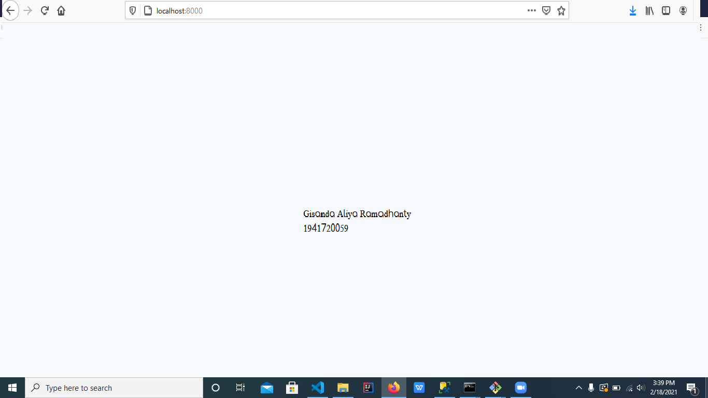

# 01 - Hello World

## Tujuan Pembelajaran

1. Mahasiswa mampu mengkonfigurasi dan instalasi laravel
2. Mahasiswa mampu mengganti tampilan welcome di laravel

## Hasil Praktikum

Tampilan setelah merubah tampilan 

[Kode program](../../src/01_hello_world/welcome.blade.php)