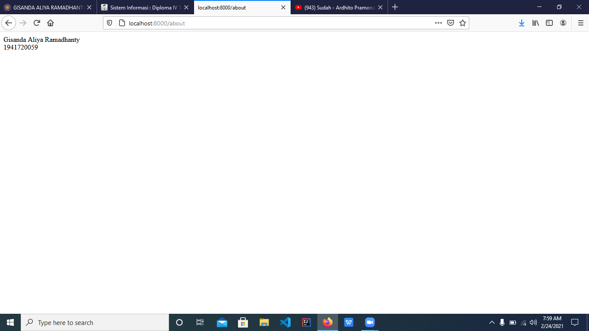
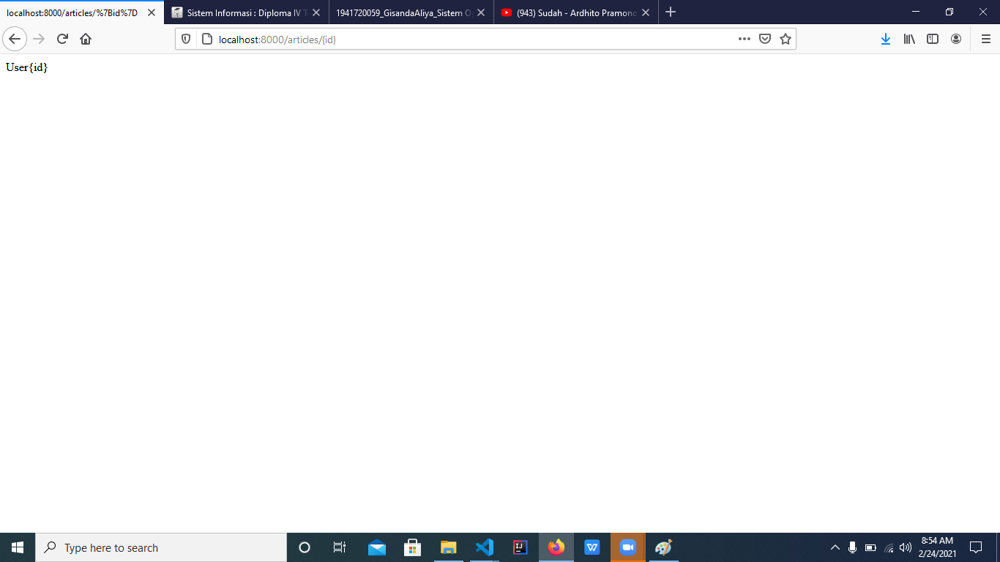
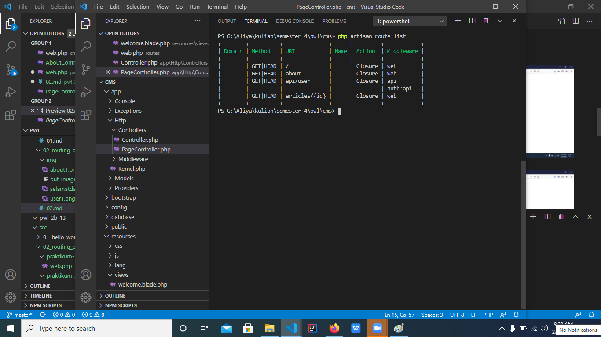

# 02 - Routing Controller

## Tujuan Pembelajaran

1. Mahasiswa memahami konsep routing Laravel Web Framework
2. Mahasiswa menerapkan routing pada Laravel Web Framework
3. Mahasiswa memahami konsep controller Laravel Web Framework
4. Mahasiswa menerapkan controller pada Laravel Web Framework

## Hasil Praktikum

### Praktikum 1 :
Hasil Gambar
- /

- /about

- /articles

[Kode program](../../src\02_routing_controller\praktikum-1\web.php)

### Praktikum 2 :
Hasil gambar
- /

- /about

- /articles

- routelist

Kode Program
- [Route](../../src\02_routing_controller\praktikum-2\web.php)
- [Page Controller](../../src\02_routing_controller\praktikum-2\PageController.php)
- [Home Controller](../../src\02_routing_controller\praktikum-2\HomeController.php)
- [About Controller](../../src\02_routing_controller\praktikum-2\AboutController.php)
- [Article Controller](../../src\02_routing_controller\praktikum-2\ArticleController.php)
