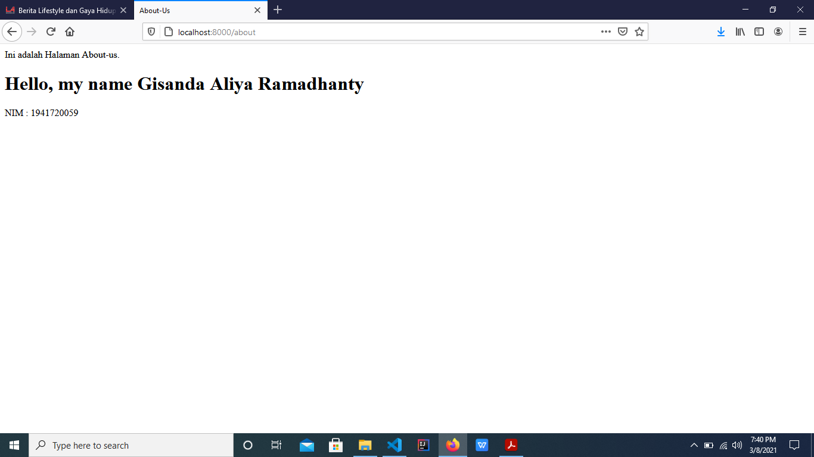
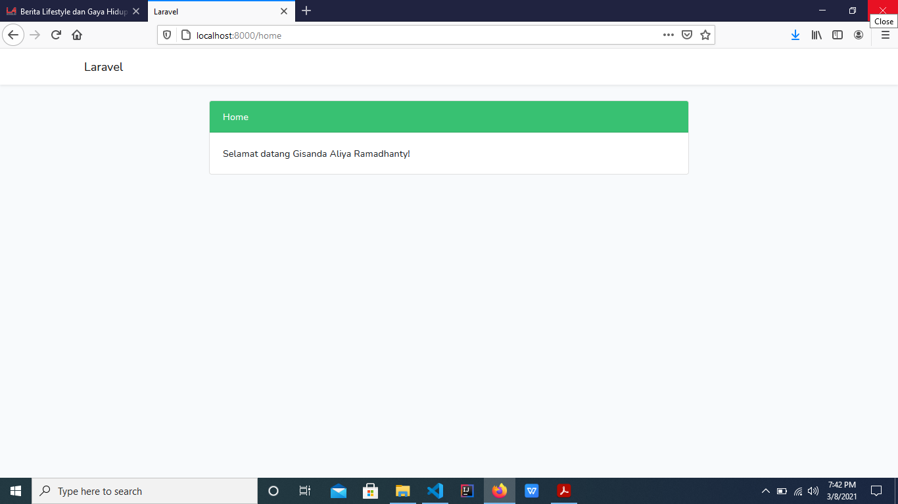
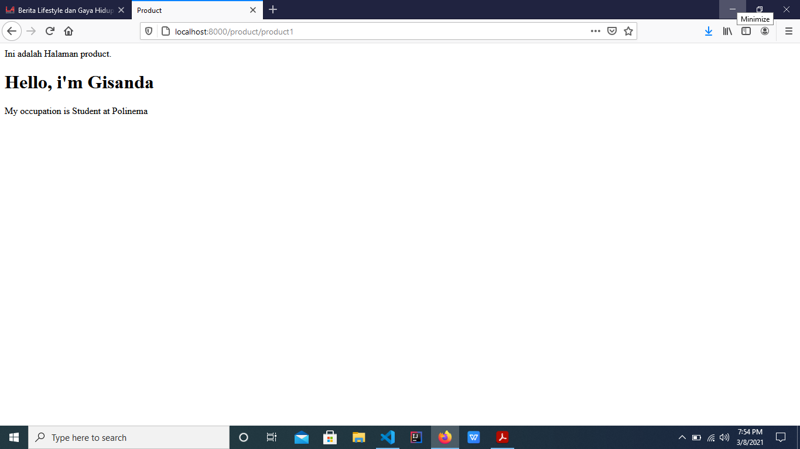
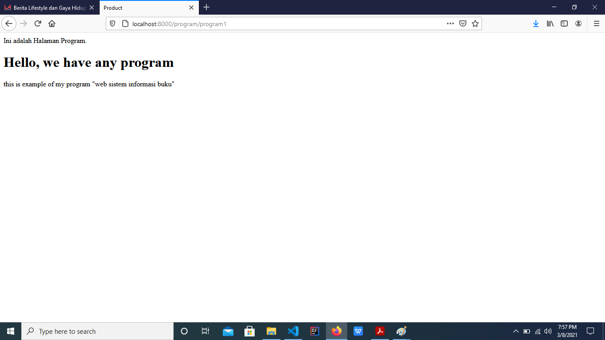
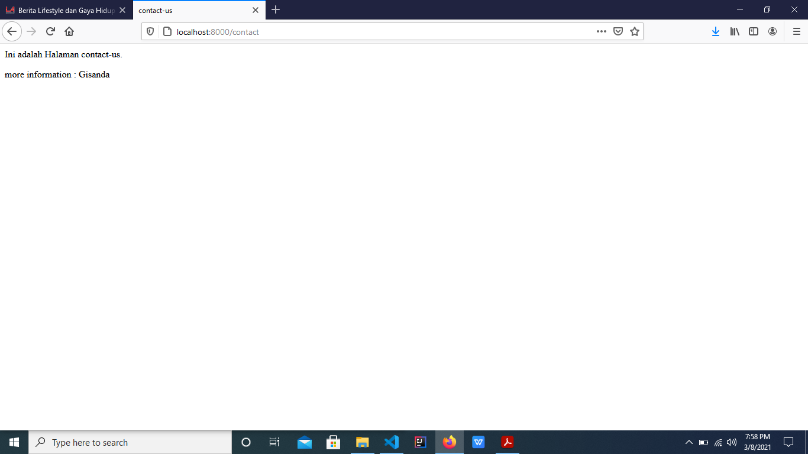

# 03 - View

## Tujuan Pembelajaran

1. Mahasiswa memahami konsep view dalam Web Framework
2. Mahasiswa menerapkan template engine pada view Web Framework
3. Mahasiswa melakukan pe-layout-an pada view Web Framework

## Hasil Praktikum

### Praktikum 1 (Individu) :
Hasil Gambar
- about

[Kode program](../../src/03_view/about-us.blade.php)
- home

[Kode program](../../src/03_view/home.blade.php)
- product

[Kode program](../../src/03_view/product.blade.php)
- program

[Kode program](../../src/03_view/program.blade.php)
- contact us

[Kode program](../../src/03_view/contact-us.blade.php)

### Praktikum 2 (Kelompok):
Hasil gambar
