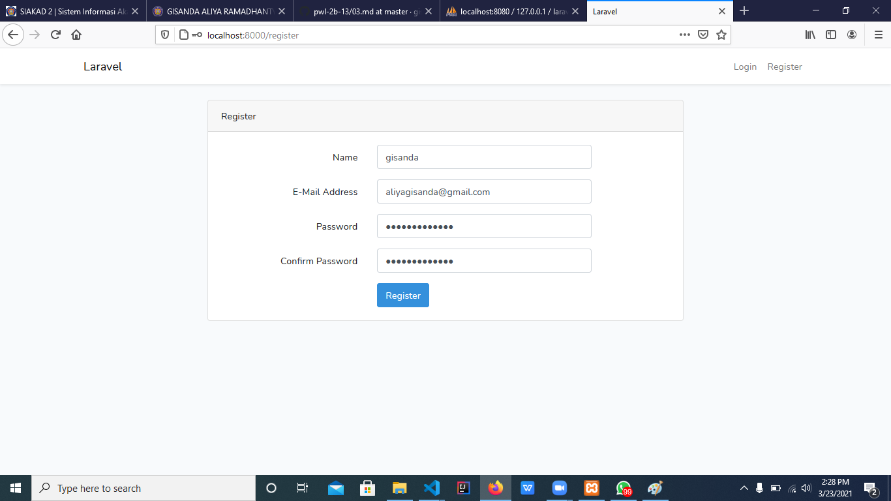
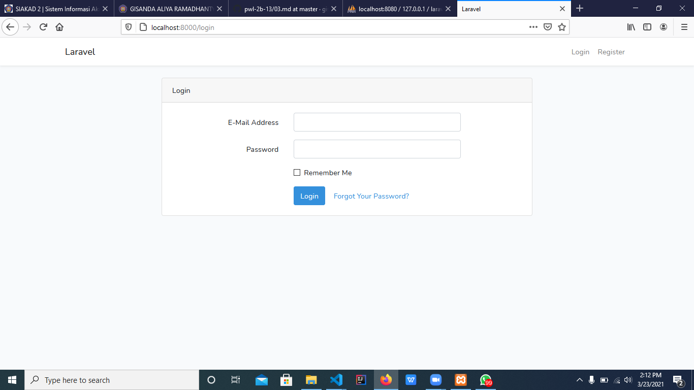
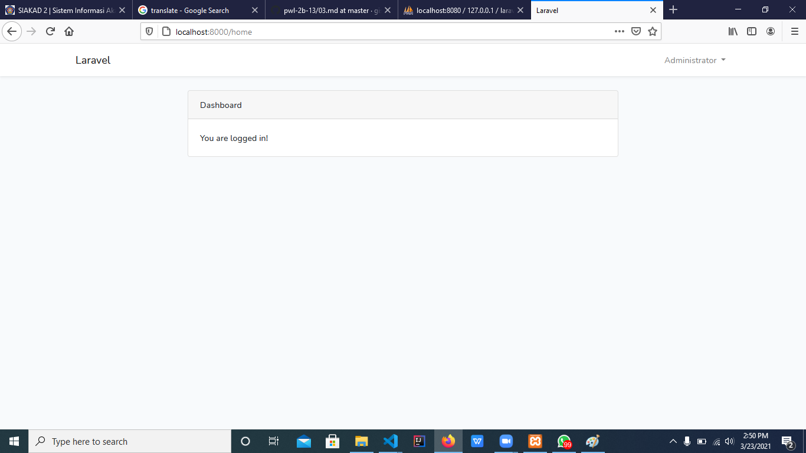
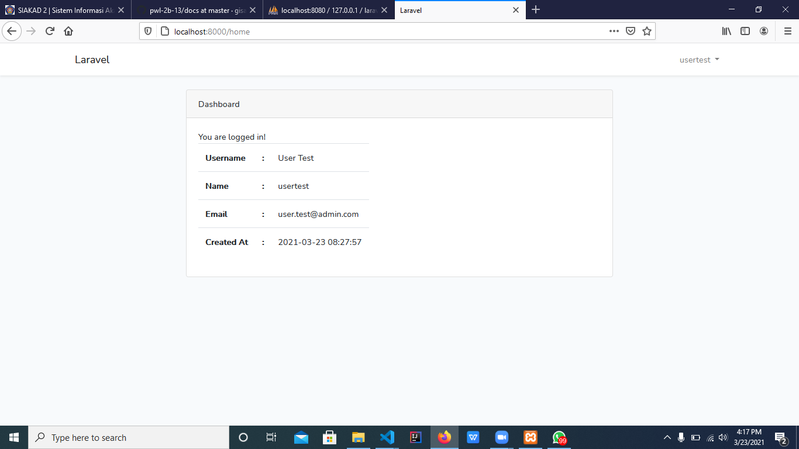

# 06 - Authentication

## Tujuan Pembelajaran

1. Mahasiswa memahami konsep Authentication
2. Mahasiswa mampu membuat custom authentication

## Hasil Praktikum

### Praktikum 1  : Membuat Auth
Hasil Gambar

!

### Praktikum 2  : Menyiapkan data awal user

### Praktikum 3  : Custom Login dengan username dan password
Hasil Gambar

