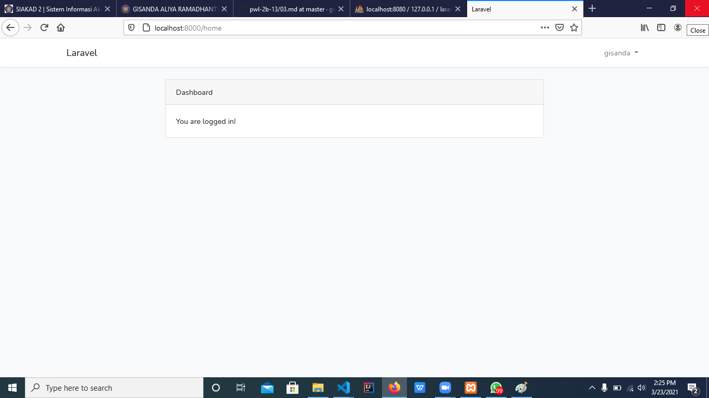
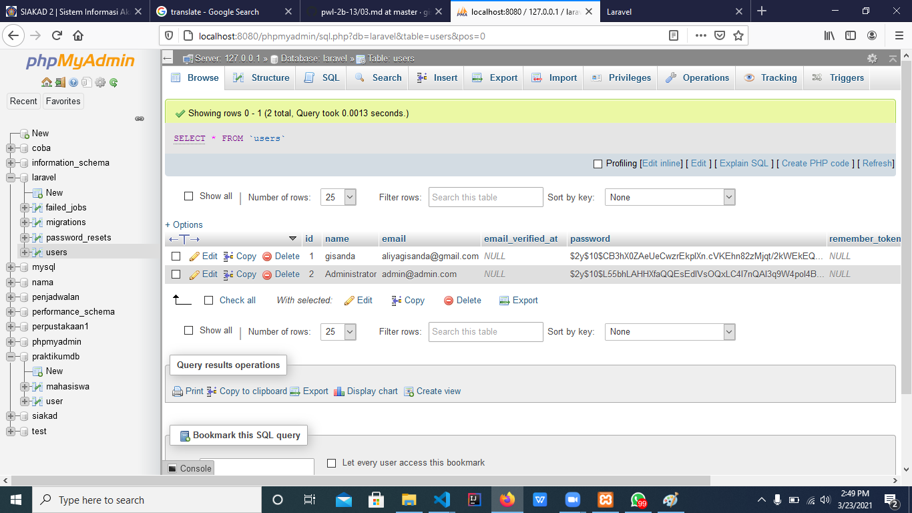

# 06 - Authentication

## Tujuan Pembelajaran

1. Mahasiswa memahami konsep Authentication
2. Mahasiswa mampu membuat custom authentication

## Hasil Praktikum

### Praktikum 1  : Membuat Auth
Register akun

Mencoba login setelah register

Ketika berhasil Login

### Praktikum 2  : Menyiapkan data awal user
Tabel user pada phpmyadmin

### Praktikum 3  : Custom Login dengan username dan password
Registrasi User

Tabel user pada phpmyadmin setelah register

Hasil saat Login

