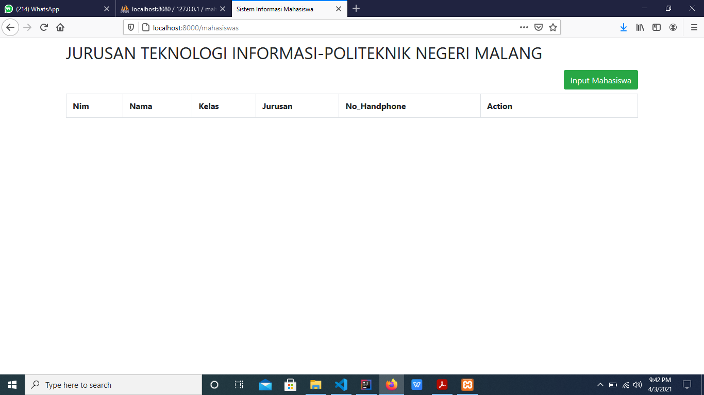
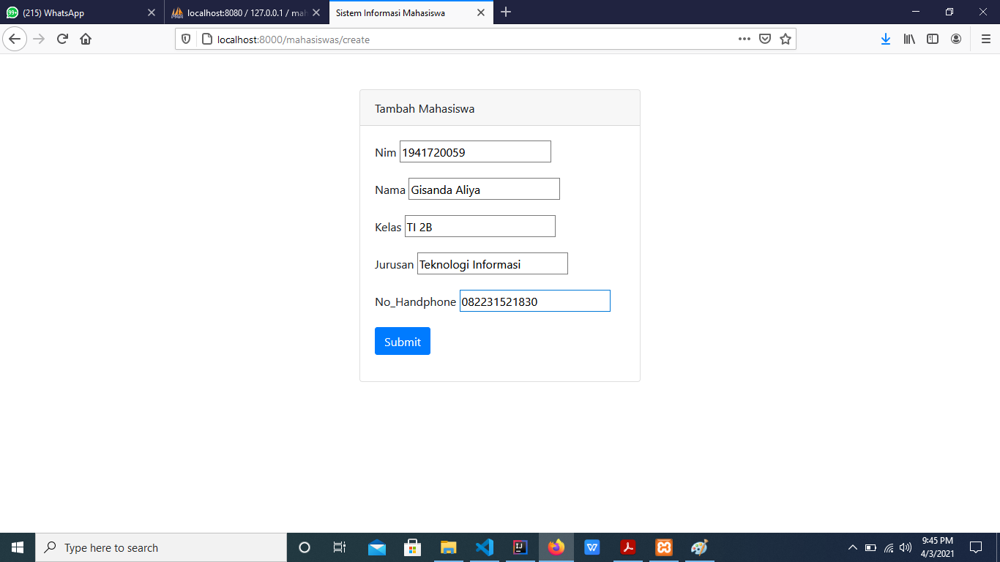
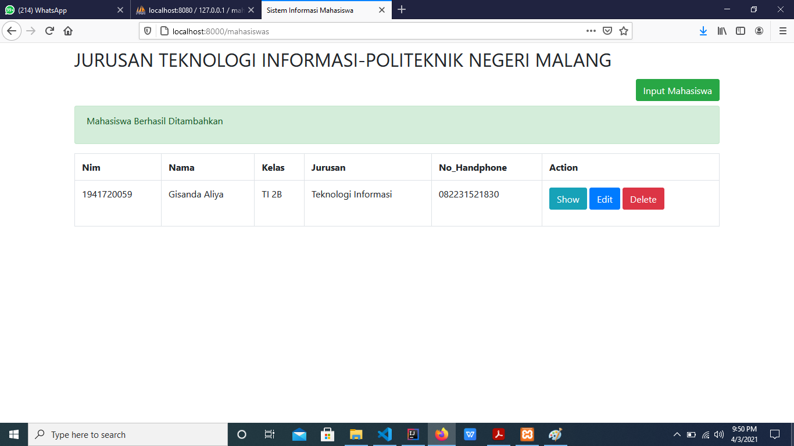
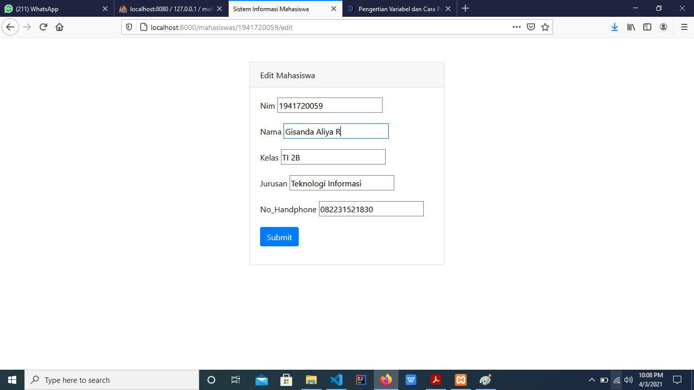
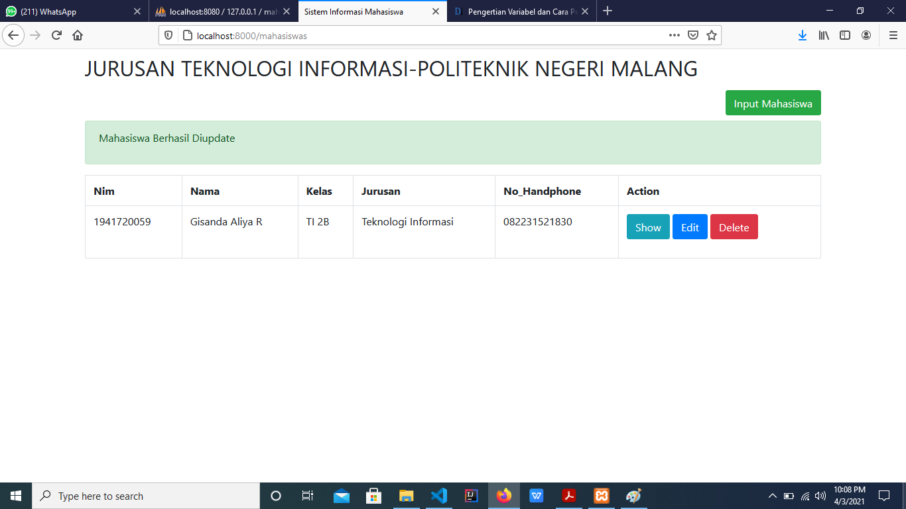
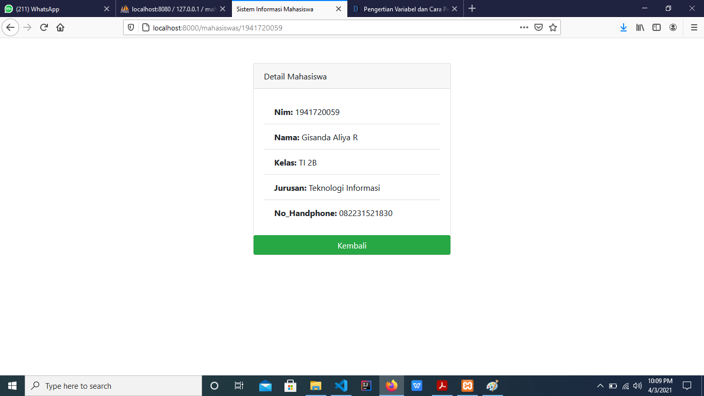
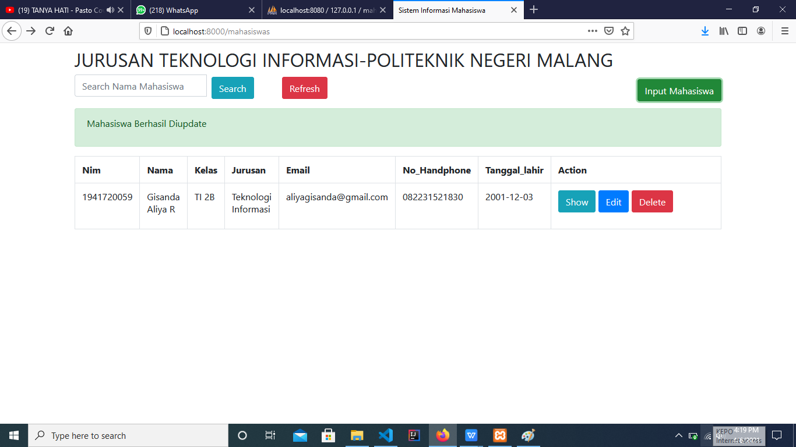
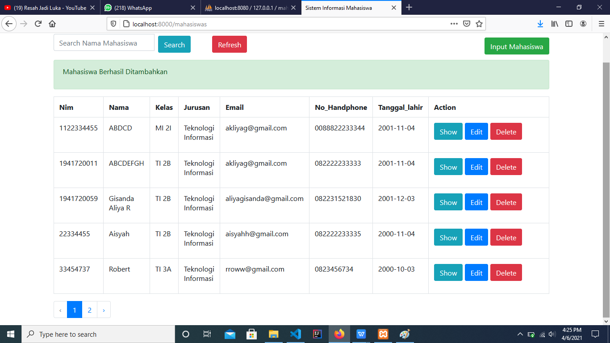
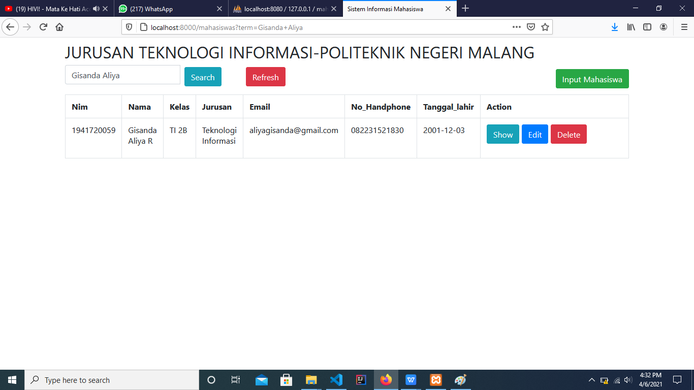

# 07 - ORM ELOQUENT DAN CRUD

## Tujuan Pembelajaran

1. Mahasiswa mampu memahami konsep ORM
2. Mahasiswa mampu melakukan operasi CRUD dengan ORM

## Hasil Praktikum

### Praktikum 1  
- Tampilan Awal

- Tampilan Input Mahasiswa

Ketika berhasil Ditambahkan

- Tampilan Edit

Ketika berhasil Diedit

- Tampilan Detail

### Praktikum 2  : Tugas
- Menambahkan Kolom Email dan Tanggal Lahir

- Menampilkan 5 Data Pada 1 Halaman

- Menampilkan Hasil Pencarian

