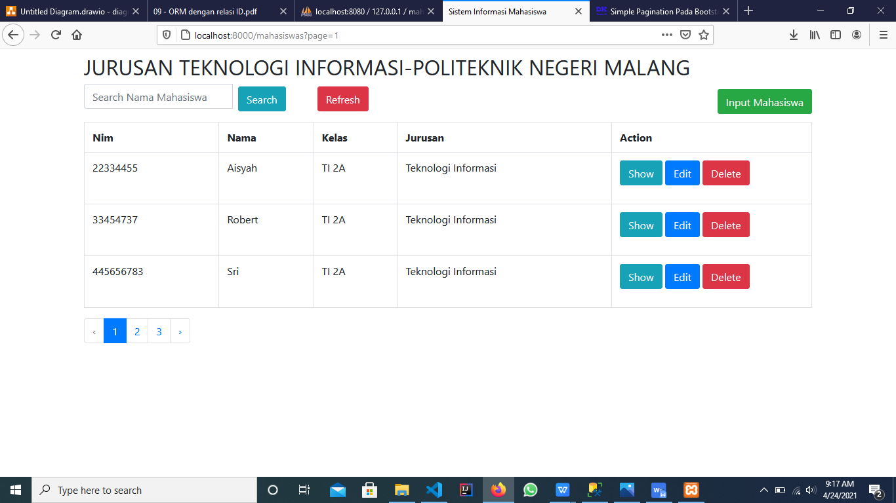
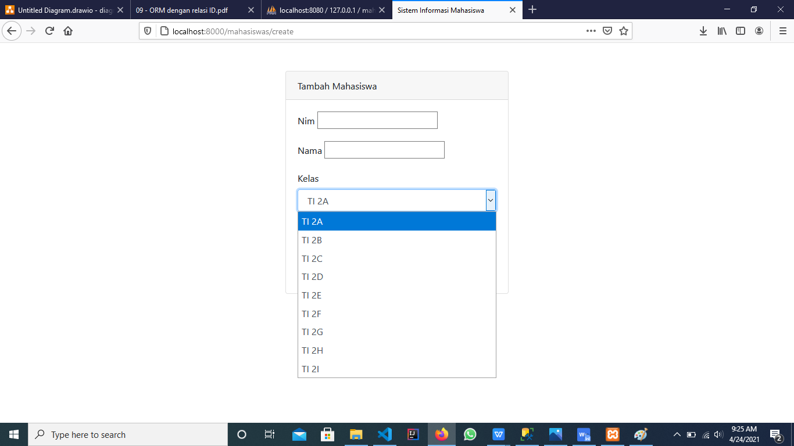
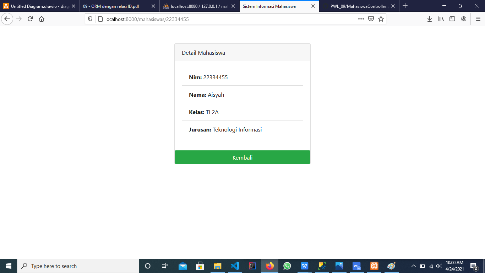
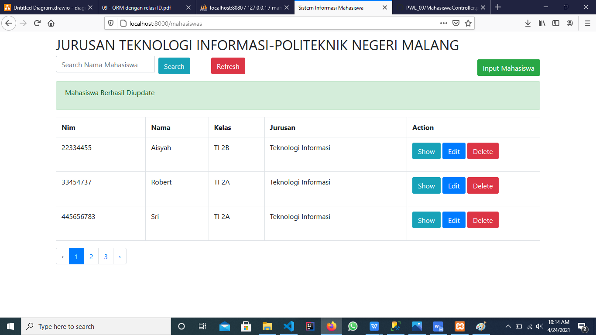
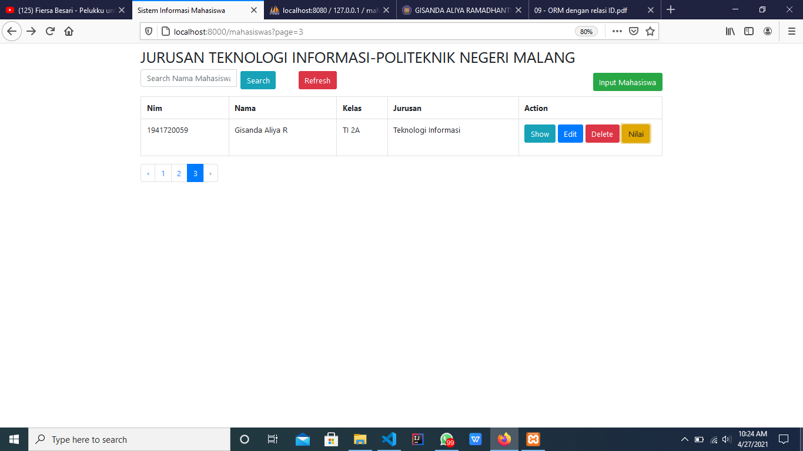
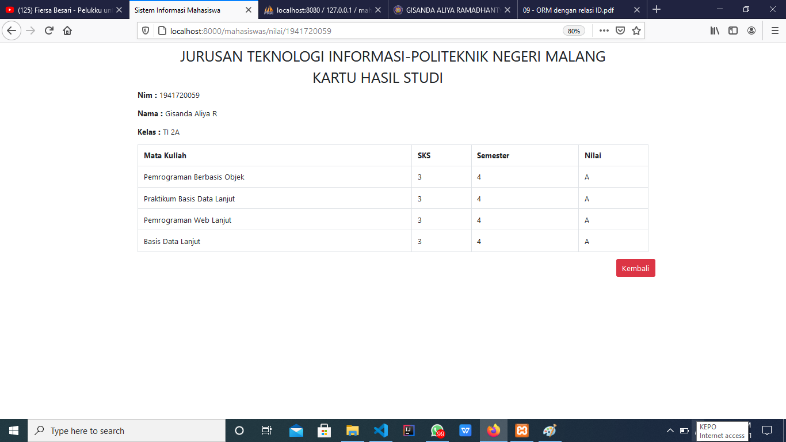

# 09 - ORM dengan Relasi

## Tujuan Pembelajaran

1.Mahasiswa mampu memahami konsep ORM dengan relasi authentication

2.Mahasiswa mampu mengimplementasikan ORM dengan relasi

## Hasil Praktikum

### Praktikum 1  
- Tampilan Awal paginate

- Tampilan Input Mahasiswa, kelas sudah diubah

- Tampilan Detail Mahasiswa

- Tampilan Edit, ketika berhasil

### Praktikum 2  dan Latihan
- Menambahkan pilihan Nilai

- Menampilkan nilai KHS

