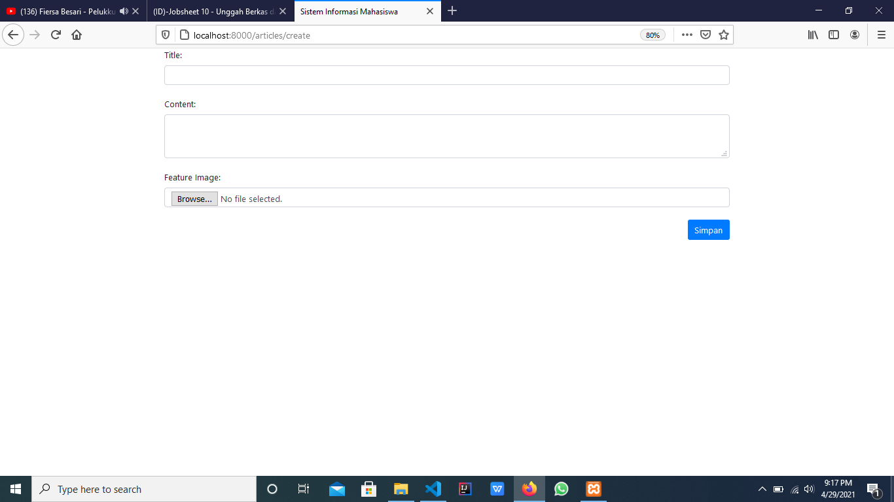
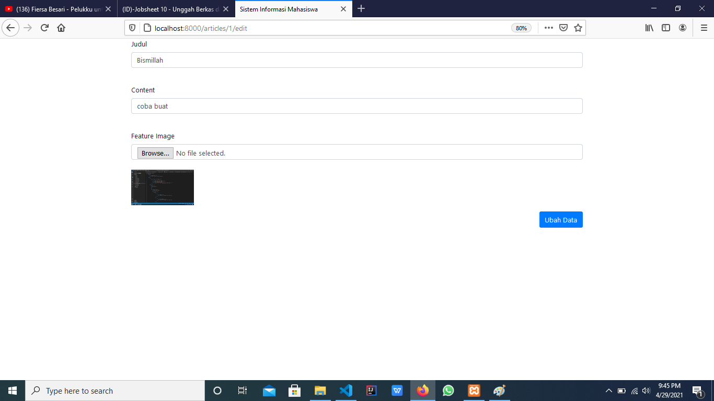
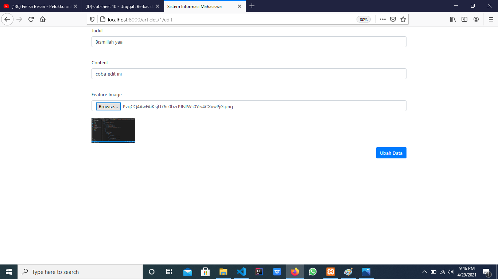
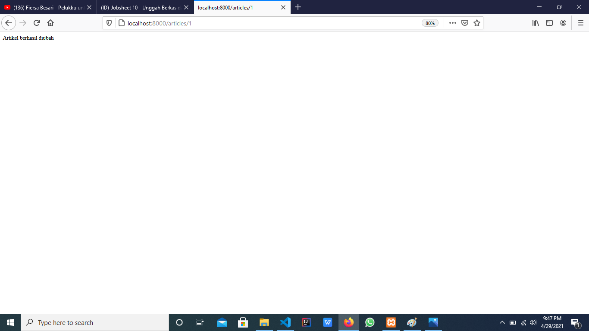
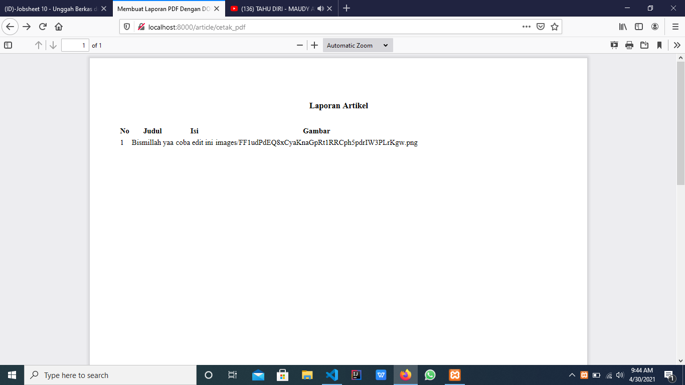
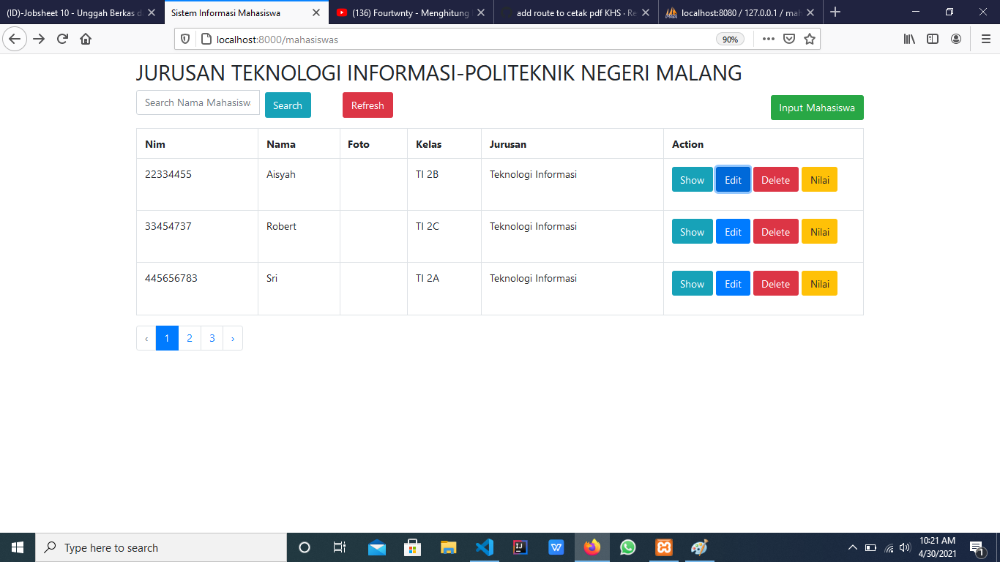
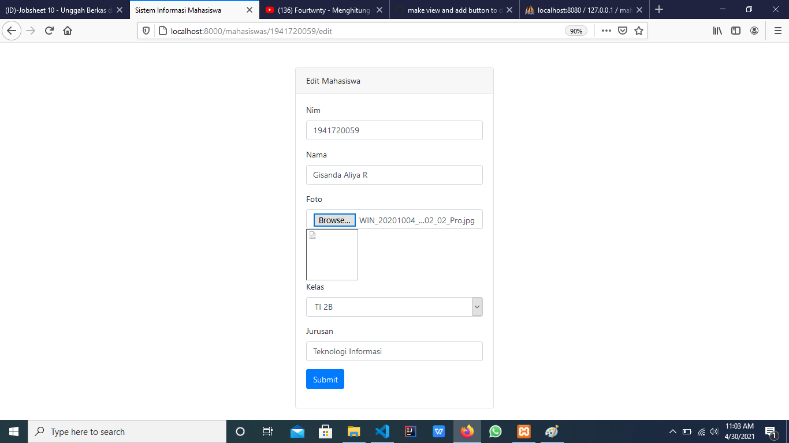
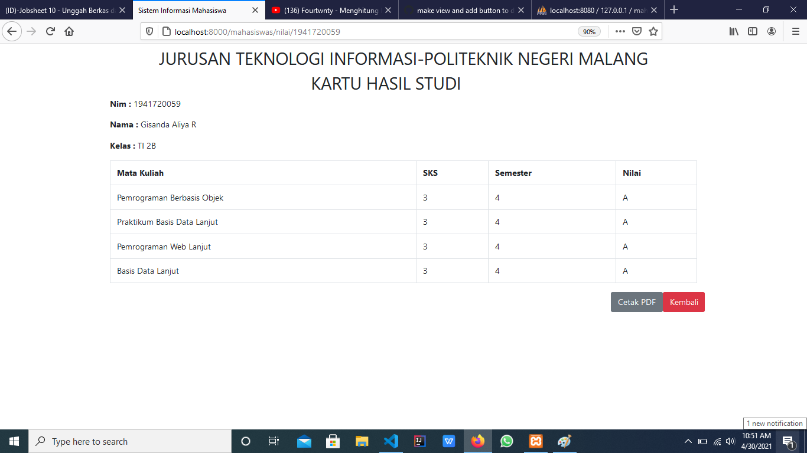
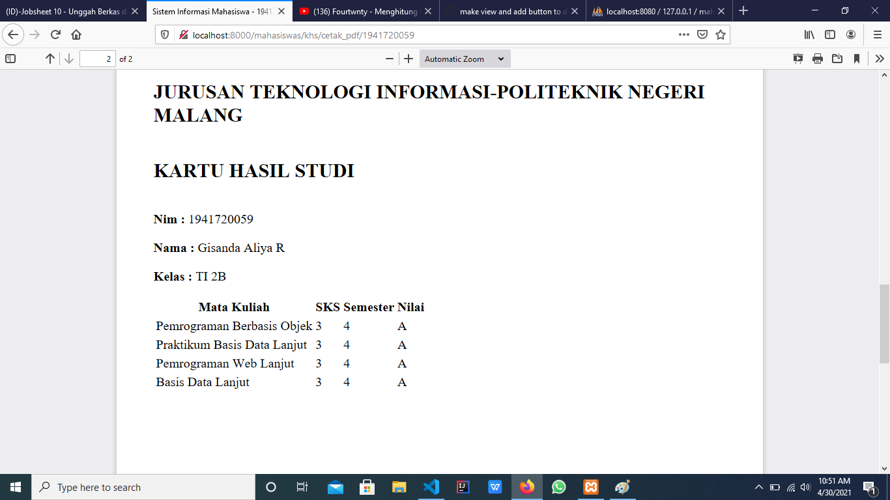

# 10 - Unggah Berkasdan Export PDF

## Tujuan Pembelajaran

1. Mahasiswa mampu membuatfitur unggah file dengan Web FrameworkLaravel
2. Mahasiswa mampu membangun fitur pelaporanberupa export file PDF

## Hasil Praktikum

### Praktikum 1  
- Tampilan Create Article

- Tampilan Article berhasil di save

### Praktikum 2  
- Tampilan Edit 

- Tampilan Article berhasil di Edit 

### Praktikum 3 
- Tampilan Cetak PDF Article

### TUGAS
- Tampilan Kolom Foto

- Tampilan Edit Foto

- Tampilan Button Cetak PDF

- Tampilan Lampiran Cetak PDF

